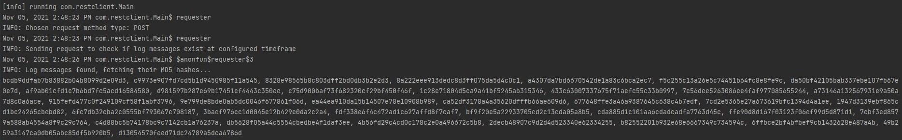
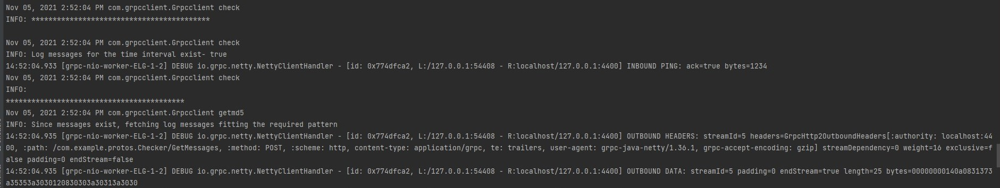
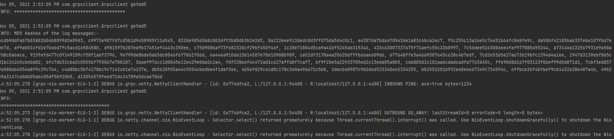

# CS 441 HW 3

## Introduction: This repository contains the various directories corresponding to the various functional requirements of the assignment.

## Project set up
+ Clone the project or download the repo in a zip format
+ Open a terminal at the root level of the any of the subdirectories
+ To run the test cases written in the scala subdirectories,

```
sbt clean compile test
```

+ To run the scala subdirectory programs

```
sbt clean compile run
```

### Explanation video:

YouTube- https://youtu.be/j89HyGQGWNI

Includes explanation of code as well.

## Application Design

These are the subdirectories:-
+ `RESTClient` is the implementation for invoking the lambda functions hosted on AWS using the REST methods of GET and POST. This directory is an individual scala project so it can be run safely with the `sbt clean compile run` to send a call to the lambda functions using REST. The configuration for this program contains a setting for using either `GET` or `POST`, the request body to be sent and the lambda functions API Gateway endpoints. This program uses Akka HTTP to send requests, and LiftWeb JSON library to encode the JSON request body to be sent in the POST request as a string.

+ `gRPCServer` is the implementation for receiving a gRPC request from a client and sending the request further to the lambda using Akka HTTP. The protobuf used to generate the classes is the same as the one used in `gRPCClient`. ScalaPB is the library used to generate the protobuf and bootstrap the server to listen on a specific port. The server is bound with a service implementation of the stub classes which call the respective lambda functions as configured in the resources. This directory is an individual scala project so it can be run safely with the `sbt clean compile run`, run this before the client to keep the server ready for the client.

+ `gRPCClient` is the equivalent of `RESTClient` for a gRPC implementation. This client is configured with ScalaPB to use the generated protobuf classes to send a request to the gRPC server with the required payload, as set in the configuration file. This directory is an individual scala project so it can be run safely with the `sbt clean compile run`, and it will send the `gRPC` server the configured request payload.

+ `LogFileGenerator` is the tried and tested log file generator program from HW2. This program is run from the EC2 instance and at the root level of this subdirectory, there is a `runner.sh` bash script which starts the logfilegenerator, switches to the log directory to pick up the logs generated by the program at the current run and send it to an S3 bucket.

+ `Lambda1` is the first lambda function, written in Python, to check if the log messages exist for a given timeframe. It does so by querying for only the first 200 bytes of the log file, and the final 200 bytes of the log file. The contents are extracted and analyzed to get the time for the first occuring log message and the final log message, to check wheter the requested timeframe falls within the bounds of the log file to be searched within. For the time comparison, the times are converted to minutes elapsed since 00:00 and compared directly, which makes the task easier and more consistent.

+ `Lambda2` is the second lambda function, written in Python, to fetch the log messages for a given timeframe. The algorithm used to do this is O(log n), as it uses a binary search implementation to get the log messages within that timeframe. First, a binary search finds the index at which the log message for requested time `T` is found. Then, the log messages before `T` are analyzed with binary search again to find the log message at `T - dT` and likewise for `T + dT`. Once the indices are found for the entire timeframe, the program goes through the indices for finding log messages which match the pattern, and if found, appends the MD5 hash of that message to be sent together with all the matched log messages. This is sent as a string for easier ingestion.


## Results

### The timeframe for these tasks were configured for messages which exist in the logfile
1. REST calls:-

<p align="center">
  
</p>


2. gRPC Calls:-

<p align="center">
  
</p>

<p align="center">
  
</p>